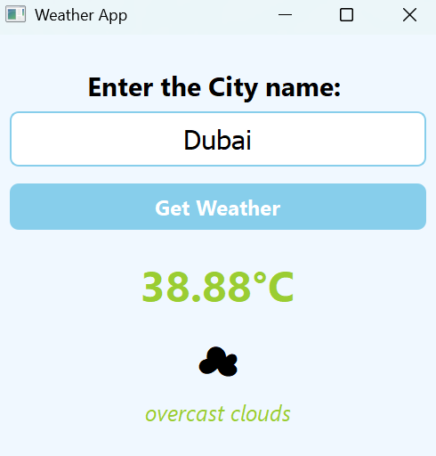

# Weather App 🌤️

A simple and elegant desktop weather application built with Python and PyQt5 that provides real-time weather information for any city worldwide.

## Features

- 🌍 Get weather data for any city globally
- 🌡️ Temperature display in Celsius
- 🎨 Clean and intuitive user interface
- 😊 Weather condition emojis for visual representation
- ⚡ Real-time weather updates
- 🔍 Detailed weather descriptions
- 💪 Robust error handling for various scenarios

## 🖼️ Screenshot

Here’s a screenshot of the Weather App in action:



## 🛠️ Technologies Used

- Python 3
- PyQt5
- Requests
- OpenWeatherMap API


## 🔧 How to Run

1. Download the **weather_app.py** and **requirements.txt** files from the repository.
2. Open a terminal in the directory where you saved the files.

Install the required dependencies using:
```
pip install -r requirements.txt
```

3. Get an API key
   - Sign up at [OpenWeatherMap](https://openweathermap.org/api)
   - Get your free API key
   - Replace `"#"` in the code with your actual API key:
     ```
     apiKey="#"
     ```

## Usage

1. **Run the application**
   ```
   python weather_app.py
   ```

2. **Using the app**
   - Enter a city name in the input field
   - Click "Get Weather" button
   - View the current temperature, weather emoji, and description

## API Integration

This app uses the [OpenWeatherMap API](https://openweathermap.org/api) to fetch real-time weather data. The app makes HTTP requests to:
```
https://api.openweathermap.org/data/2.5/weather?q={city}&appid={apiKey}
```

